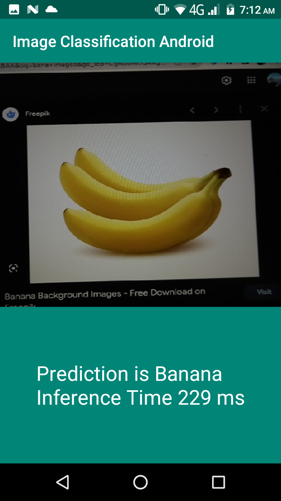

# ImageClassificationAndroid
Implementation image classification using CNN custom model.

## - Output:

</img>

## - Step By Step Article on Medium:

https://mikalshrestha.medium.com/sending-push-notification-to-android-from-react-app-using-spring-boot-rest-api-and-fcm-a4bde40d62f1

